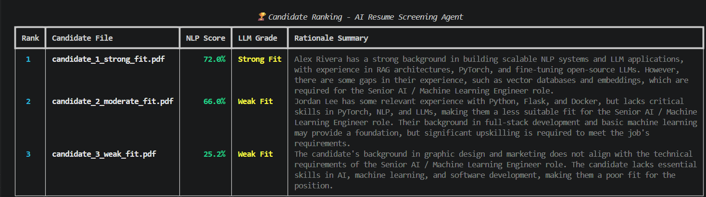

# 🏆 AI Resume Screening Agent

**ROOMAN AI CHALLENGE - 24-Hour AI Agent Selection Round** *Junior AI Research Associate Track*

This repository contains a working, end-to-end AI Resume Screening Agent built in Python.

>  *"My agent takes a directory of PDF resumes and a Job Description and produces a scored, ranked candidate shortlist using mathematical NLP embeddings and qualitative LLM analysis."*

---

## 📦 Project Deliverables Checklist

This project fulfills all required deliverables for the **Resume Screening Agent (Intermediate)** track:
* ✅ **Job Description (JD):** Located at `data/job_description.txt` (or auto-generated via setup script).
* ✅ **Folder of Sample Resumes:** PDF resumes located at `data/sample_resumes/`.
* ✅ **Ranked Output:** Exported to `data/output/ranked_candidates.csv` and rendered in terminal UI.
* ✅ **Scoring Method Note:** Detailed below in the Architecture section and code comments.

---

## 🛠️ Requirements & Setup

### Prerequisites
* Python 3.10+
* Free Groq API Key (get one instantly at [console.groq.com](https://console.groq.com/))

### 1. Clone the Repository
First, get the code onto your local machine and navigate into the project directory:

**Step A: Verify Git is Installed**
You will need Git installed on your computer. If you don't have it, you can download it from [git-scm.com](https://git-scm.com/).

**Step B: Clone the Code**
Open your computer's terminal (Command Prompt on Windows, or Terminal on Mac/Linux) and run this exact command to download the project:
```bash
git clone [https://github.com/MojeshSetty/rooman-ai-resume-agent.git](https://github.com/MojeshSetty/rooman-ai-resume-agent.git)
cd rooman-ai-resume-agent
```

Step C: Navigate into the Folder
Once downloaded, move your terminal into the new project folder by running:
```
cd rooman-ai-resume-agent
```

### 2. Environment Setup

Open your terminal in VS Code and run:

```bash
# Create virtual environment
python -m venv venv

# Activate virtual environment
# On Windows (PowerShell):
.\venv\Scripts\activate

# On macOS / Linux:
source venv/bin/activate

```

### 3. Install Dependencies

Install the pinned packages:

```bash
pip install -r requirements.txt
```
Note on Dependencies: torch>=2.9.0 and groq>=0.5.0 are configured to prevent system-specific architecture conflicts and httpx version mismatches.

### 4. API Key Configuration

1.Create a .env file in the root project directory (use .env.example as a template).

2.Add your Groq API key:
```Code Snippet
GROQ_API_KEY=your_actual_groq_api_key_here
```
---

## 🚀 How to Run the Agent

### Step 1: Generate Mock Data (If running for the first time)
To populate sample candidate PDFs across various qualification tiers (Strong, Moderate, Weak fit), execute:
```bash
python generate_mock_resumes.py
```
### Step 2: Run the Screening Agent
Execute the main entry point:
```bash
python main.py
```
---
## 📊 Output Examples
When executed, the agent:
1. Renders a color-coded evaluation table directly in the terminal CLI using rich.

2. Generates a structured CSV export at data/output/ranked_candidates.csv.

### Output CSV Structure


---
## 🧠 Architecture & Scoring Method
The agent combines mathematical vector matching with qualitative LLM reasoning:
```Plain text
[ PDF Resumes ] ──> PyMuPDF Parser ──┐
                                     ├──> SentenceTransformers (MiniLM-L6-v2) ──> Cosine Similarity (0-100%)
[ Job Description ] ─────────────────┤
                                     └──> Groq API (Llama-3.3-70b) ─────────────> JSON Qualitative Rationale
                                                                                        │
                                                                                        ▼
                                                                             [ Ranked Output CSV / CLI ]
```
1. Text Extraction: PyMuPDF extracts clean text streams from incoming candidate PDFs.
2. Quantitative Scoring (NLP Similarity): sentence-transformers (all-MiniLM-L6-v2) generates vector embeddings for both the Job Description and each resume text. Cosine similarity calculates a mathematical match score ($0 - 100\%$).
3. Qualitative Scoring (LLM Reasoning): The parsed text is sent to the Groq API (llama-3.3-70b-versatile) with a JSON-enforced system prompt. The model evaluates experience context, identifies missing/matched skills, and assigns a qualitative grade.
4. Data Aggregation: pandas and rich aggregate and format the dual-layer evaluation into exported reports.
---
## ⚖️ Tradeoff Notes & Limitations
> PDF Layout Flattening: Standard plain-text PDF extraction via PyMuPDF strips multi-column layouts and visual formatting. A production system would incorporate Vision-Language Models (VLMs) or OCR, but lightweight text extraction was chosen for execution speed within the 24-hour limit.

> Mitigating Keyword Stuffing: Cosine similarity can be biased toward raw word overlaps. To counter this, the secondary LLM qualitative check evaluates actual job context, reducing the likelihood of keyword-stuffed resumes scoring high.

> Context Length Constraints: Processing entire multi-page resumes directly into the prompt can approach context limits or introduce noise. Future iterations would utilize a chunked RAG workflow for long documents.
